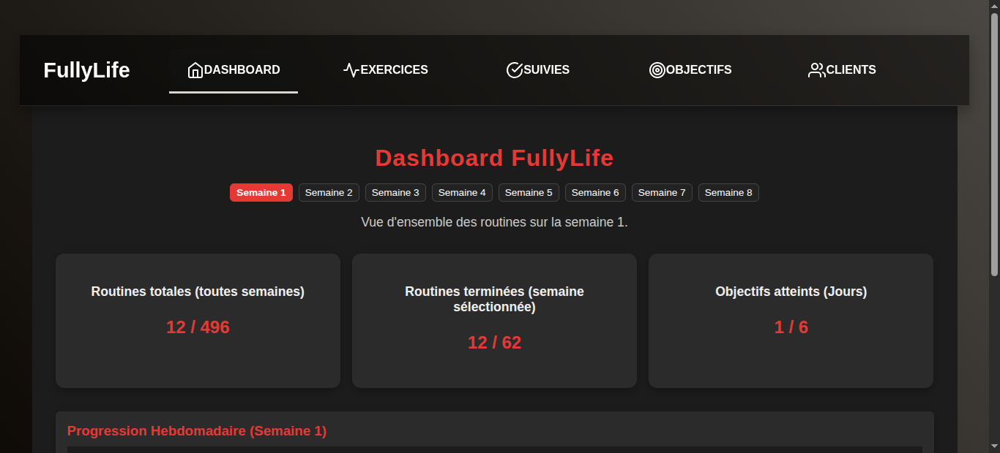
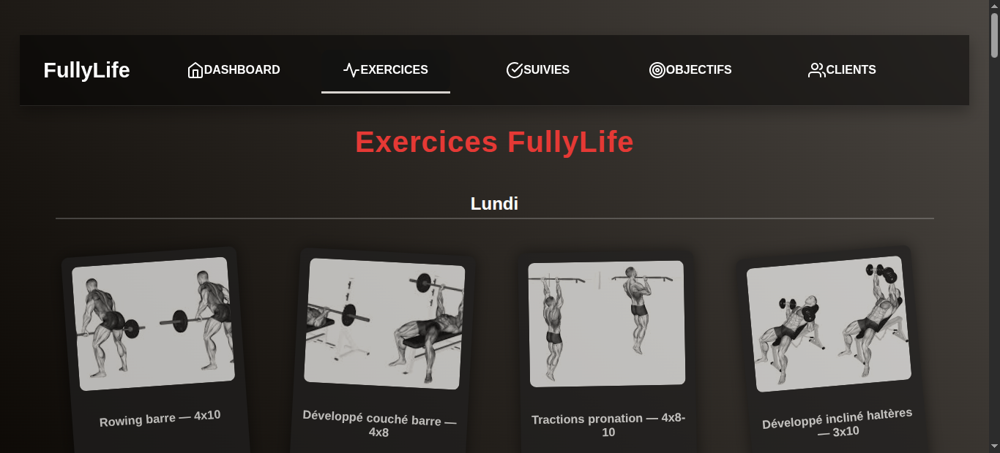
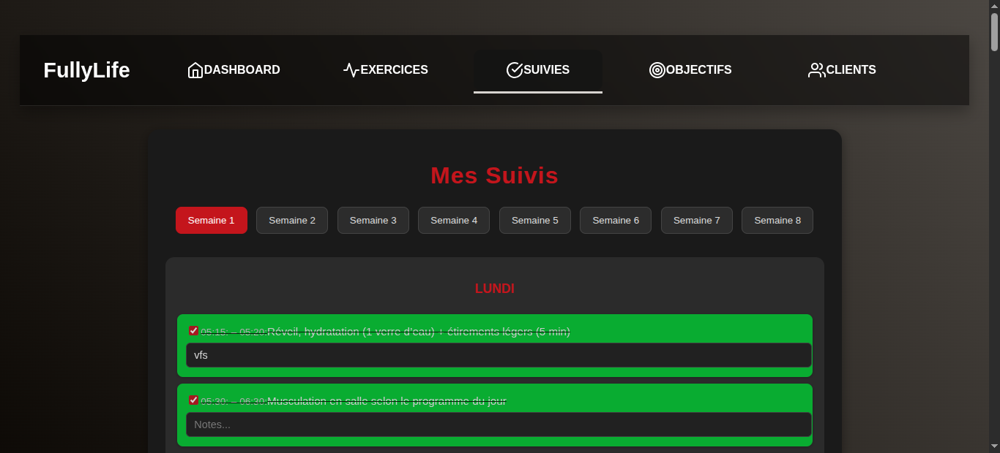
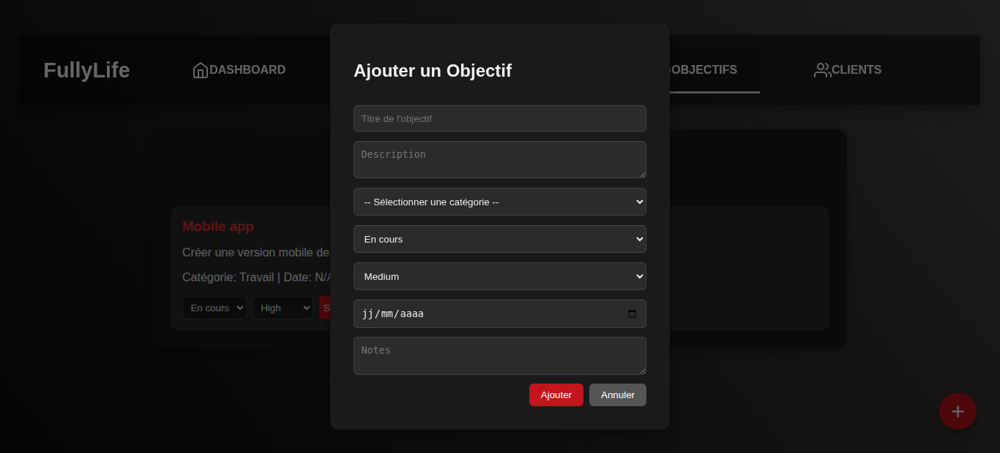

# FullyLife

FullyLife est une application **web et mobile** de gestion quotidienne
de routines, suivie d'objectifs et de progression hebdomadaire et **bien plus encore en mis a jour**.\
Elle permet de suivre des routines journalières, de marquer les tâches
comme complétées, et d'analyser les statistiques via un tableau de bord
interactif.

------------------------------------------------------------------------

## 📌 Table des matières

-   [Fonctionnalités](#fonctionnalités)
-   [Screenshots](#screenshots)
-   [Stack technique](#stack-technique)
-   [Installation](#installation)
-   [Structure du projet](#structure-du-projet)
-   [Fonctionnalités détaillées](#fonctionnalités-détaillées)
-   [Mobile App](#mobile-app)
-   [Auteur](#auteur)

------------------------------------------------------------------------

## 🚀 Fonctionnalités

-   Gestion des **routines quotidiennes** avec horaires et
    descriptions.\
-   Marquer une tâche comme **complétée** (`completed`).\
-   Visualiser les routines par **semaine** et **par jour**.\
-   Dashboard interactif avec :
    -   Routines totales\
    -   Routines complétées\
    -   Objectifs atteints (jours 100%)\
    -   Graphique hebdomadaire\
-   Navigation par semaine\
-   **Design moderne dark mode**, style Trello\
-   **Responsive web et mobile**\
-   Base de données pré-remplie avec **8 semaines de routines**

------------------------------------------------------------------------

## 🖼️ Screenshots

### 🌐 Web --- Dashboard



### 🌐 Web --- Exercices



### 🌐 Web --- Suivies



### 🌐 Web --- Objectifs



------------------------------------------------------------------------

### 📱 Mobile --- Dashboard


### 📱 Mobile --- Exercices


### 📱 Mobile --- Suivies


### 📱 Mobile --- Objectifs


------------------------------------------------------------------------

## 🧰 Stack technique

### **Front-end (Web)**

-   React\
-   TypeScript\
-   Recharts\
-   CSS moderne

### **Mobile App**

-   Expo + React Native\
-   Expo Router\
-   APK Android générée via Expo Prebuild + Gradle

### **Back-end**

-   Ruby on Rails API\
-   PostgreSQL\
-   Axios pour les requêtes HTTP

------------------------------------------------------------------------

## 🛠️ Installation

### 📌 Prérequis

-   Node.js (v18+)\
-   Ruby (v3+) / Rails (v7+)\
-   PostgreSQL (v14+)

------------------------------------------------------------------------

## 🔧 Installation du Back-end (Rails API)

``` bash
cd fully_service
bundle install
rails db:create
rails db:migrate
rails db:seed
rails s
```

➡ L'API tourne sur :\
**http://127.0.0.1:3000/api/v1/suivis**

------------------------------------------------------------------------

## 💻 Installation du Front-end (React)

``` bash
cd fullylife
npm install
npm start
```

➡ Le front tourne sur :\
**http://localhost:3001**

------------------------------------------------------------------------

## 📊 Fonctionnalités détaillées

### **Suivis / Routines**

-   Affichage des routines par semaine et jour\
-   Checkbox pour marquer completed\
-   Jour complètement rempli = objectif atteint\
-   Support natif pour 8 semaines

### **Dashboard**

-   Routines totales\
-   Routines complétées\
-   Objectifs atteints (jours)\
-   Graphique par jour (bar chart)\
-   Navigation interactive des semaines

### **UI / UX**

-   Style Trello (colonnes verticales)\
-   Dark mode complet\
-   Responsive tablette / mobile\
-   Animations : hover, légère rotation, zoom sur les cartes

------------------------------------------------------------------------

## 📱 Mobile App

### 📦 Installation du projet mobile

``` bash
cd fullylifemobile
npm install
npx expo prebuild
```

### 📲 Génération APK (release)

``` bash
cd android
./gradlew assembleRelease
```

APK générée →\
`android/app/build/outputs/apk/release/app-release.apk`

------------------------------------------------------------------------

## 👤 Auteur

Développé par **Hassy Tsihoarana**, Fullstack Developer.
